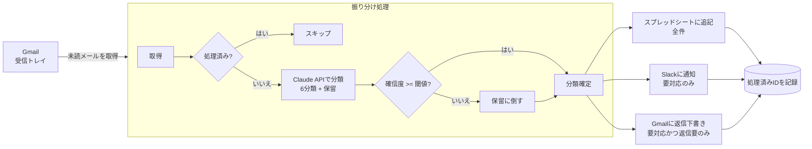

# ai-mail-triage

[](https://github.com/kamio-jukiya/ai-mail-triage/actions/workflows/ci.yml)

受信メールを生成AI（Claude API）で6分類し、**記録・通知・返信下書き作成**までを一本の流れで処理するツールです。

問い合わせ窓口のメールを人が1通ずつ振り分けている状態を、機械が下処理して人は判断だけに集中する状態に変えることを目的にしています。

---

## まず動かす

APIキーもネットワーク接続も不要です。クローンして2コマンドで動きます。

```bash
npm install && npm run demo
```

`fixtures/emails.json` の8通のサンプルメールを、ルールベースの分類器で振り分けます。実行するとこうなります。

```
──────────────────────────────────────────
  実行結果 (デモ)
──────────────────────────────────────────
  取得        : 8 件
  処理        : 8 件
  スキップ    : 0 件 (処理済み)
  保留        : 2 件 (うち確信度 0.6 未満による差し戻し 1 件)
  通知        : 6 件
  下書き作成  : 4 件
  失敗        : 0 件

  分類の内訳:
    新規問い合わせ　　　 1 件
    見積依頼　　　　　　 1 件
    既存顧客サポート　　 1 件
    日程調整　　　　　　 1 件
    営業・売り込み　　　 1 件
    自動通知　　　　　　 1 件
    保留（要目視）　　　 2 件

  保留になったメール (人の確認が必要):
    - 先日の件 (kato@unknown-example.jp)
      理由: 確信度 0.45 が閾値 0.6 未満のため保留。（分類器の判断: inquiry / ...）
    - （件名なし） (info@example-ltd.jp)
      理由: ルールベース判定: 一致するキーワードが無く、判断できませんでした
──────────────────────────────────────────
```

デモでは Claude API の代わりにルールベースの分類器（`StubClassifier`）を使い、Gmail の代わりに JSON ファイルを読みます。外部への通信は一切ありません。

---

## 全体構成



定期実行は **GitHub Actions**（平日 9:00 / 13:00 / 17:00 JST）。サーバを持たずに動かせて、実行履歴がそのまま監査ログになります。

定期実行は `TRIAGE_ENABLED` 変数が `true` のときだけ走ります。設定が済むまで空振りさせないための入り切りスイッチで、このリポジトリでは未設定のため動きません（CIとデモは動きます）。

### 分類カテゴリ

| key | 意味 | 通知 | 返信下書き |
|---|---|---|---|
| `inquiry` | 新規の問い合わせ | ○ | ○ |
| `quote_request` | 見積依頼 | ○ | ○ |
| `existing_support` | 既存顧客からのサポート依頼 | ○ | ○ |
| `appointment` | 日程調整 | ○ | ○ |
| `vendor_sales` | 営業・売り込み | – | – |
| `notification` | 自動通知・システムメール | – | – |
| **`unclassified`** | **保留（判定できなかったもの）** | **○** | – |

---

## 設計上の判断

技術選定より、**運用に乗るかどうか**を優先して設計しています。以下の6点がこのツールの中身です。

### 1. 保留の受け皿を必ず持つ

AIによる分類の失敗は「間違ったカテゴリに入る」形で起きます。しかも間違いは誰にも気づかれません。

そこで分類器には確信度（0.0〜1.0）を返させ、閾値（既定 0.6）未満なら機械的に **保留（`unclassified`）** に倒します。保留は必ずSlackに通知され、人の目に触れます。

```ts
// src/core/classify.ts
export function applyConfidenceThreshold(classification, threshold) {
  // 閾値未満なら分類を捨てて保留にし、元の判定は記録に残す
  // 確信の持てない分類に基づく返信下書きも同時に捨てる（送信事故の防止）
}
```

**保留に倒したメールの返信下書きは作りません。** 分類を信用していないのに、その分類に基づく下書きを人の手元に置くのは事故のもとです。

### 2. 冪等性（同じメールを二度処理しない）

定期実行は必ず二重に走ります。Actions の再実行、手動でのやり直し、cronの重複。処理済みメッセージIDを永続化し、2回目以降はスキップします。

書き込みが**全部成功してから**処理済みに記録します。途中で落ちたメールは未処理のまま残り、次回の実行で自動的に拾い直されます。

### 3. リトライ（再試行してよいものだけ再試行する）

| エラー | 判断 | 理由 |
|---|---|---|
| `RateLimitError` (429) | 再試行する | 待てば通る |
| 5xx | 再試行する | サーバ側の一時的な問題 |
| 接続エラー | 再試行する | ネットワークの瞬断 |
| 400 / 401 / 403 / 404 | **即座に失敗** | 何度投げても同じ。課金だけ増える |

エラー判定は SDK の例外クラスで行い、メッセージ文字列でのマッチはしていません（SDKの文言が変わると黙って壊れるため）。

### 4. 構造化ログ（1行1JSON）

標準出力は1行1JSONに統一し、人間向けのサマリは標準エラーに出しています。標準出力をそのまま `jq` に流せます。

```bash
node dist/index.js --demo | jq 'select(.event == "message.classified") | {subject, category, confidence}'
```

止まったときに「どのメールで」「どの段階で」「何が起きたか」を機械的に追える形が必要でした。

### 5. ドライラン

```bash
npm run dry-run
```

本番のメールを本番の分類器で分類し、**記録・通知・下書き作成だけをしません**。閾値を変えたときの影響確認や、導入初期の慣らし運転に使います。

### 6. Adapter 分離

`Classifier` / `MailSource` / `RecordSink` / `Notifier` / `DraftWriter` / `ProcessedStore` をインターフェースで切り、実装を差し替えられるようにしています。

| インターフェース | デモ実装 | 本番実装 |
|---|---|---|
| `Classifier` | `StubClassifier`（ルールベース） | `ClaudeClassifier`（Claude API） |
| `MailSource` | `FixtureMailSource`（JSON） | `GmailMailSource` |
| `RecordSink` | `ConsoleRecordSink` | `SheetsRecordSink` |
| `Notifier` | `ConsoleNotifier` | `SlackNotifier` |
| `DraftWriter` | `ConsoleDraftWriter` | `GmailDraftWriter` |
| `ProcessedStore` | `MemoryProcessedStore` | `FileProcessedStore` |

APIキー無しでデモが動くのも、テストが外部サービスに触れないのも、この分離の副産物です。連携先が Slack から Teams に変わっても、差し替えるのは1ファイルで済みます。

---

## ディレクトリ構成

```
src/
  index.ts             CLIエントリ（--demo / --dry-run / 本番）
  config.ts            環境変数の読み込みと検証
  logger.ts            構造化ログ
  retry.ts             指数バックオフ
  core/
    types.ts           ドメイン型とインターフェース定義
    classify.ts        分類スキーマ・プロンプト・閾値判定
    pipeline.ts        オーケストレーション
    store.ts           処理済みID管理
  adapters/
    claude.ts          Claude API による分類
    stub.ts            ルールベース分類（デモ用）
    gmail.ts           Gmail 読み取り・下書き作成
    sheets.ts          スプレッドシート追記
    slack.ts           Slack通知
    memory.ts          デモ・テスト用のインメモリ実装
  *.test.ts            テスト（node:test）
fixtures/emails.json   サンプルメール
docs/
  requirements.md      要件定義書
  operations.md        運用手順書（非エンジニア向け）
```

---

## 本番で動かす

設定と初期セットアップの手順は **[docs/operations.md](docs/operations.md)** にまとめています。エンジニアでない担当者が読んで設定できる粒度で書いてあります。

### Google の認証は2方式

対象のメールアドレスによって使える方式が変わります。

| 対象 | 方式 | 備考 |
|---|---|---|
| Google Workspace | サービスアカウント + ドメイン全体の委任 | 管理コンソールでの委任設定が必要。無人で動き、トークンの失効がない |
| 個人の `@gmail.com` | OAuth（リフレッシュトークン） | `npm run auth:google` で最初の1回だけ許可する |

ドメイン全体の委任は Workspace の管理コンソールにしかない機能で、個人アカウントには委任元のドメインが存在しません。**個人のGmailではサービスアカウント方式は選択肢になりません。** 環境変数から方式を自動判定し、両方の設定がある場合だけ `GOOGLE_AUTH_MODE` で明示させています。

OAuth側には運用を止める罠が2つあります（同意画面が「テスト」状態だとリフレッシュトークンが7日で失効する／`gmail.*` は制限付きスコープで未確認アプリの警告が出る）。どちらも [docs/operations.md](docs/operations.md) の 3-2B に、症状と直し方を書いてあります。

要求するスコープに `gmail.send` は含めていません。**下書きの作成までしかできない権限しか持たせない**ことで、不具合が起きても顧客にメールが飛ばない状態を保っています。

```bash
cp .env.example .env   # 値を埋める
npm run dry-run        # まず書き込みなしで確認
npm start              # 本番実行
```

必要な設定は `.env.example` を参照してください。`ANTHROPIC_API_KEY` だけあれば、記録先・通知先が未設定でもコンソール出力にフォールバックして動きます。

---

## 開発

```bash
npm run typecheck   # 型チェック
npm test            # テスト（43件）
npm run demo        # デモ実行
```

テストは Node 標準の `node:test` のみで書いています。外部サービスには一切接続しません。検証しているのは主に運用時の挙動です。

- 確信度が閾値未満のとき保留に倒れること、そのとき返信下書きを捨てること
- 2回目の実行で処理済みがスキップされること（冪等性）
- `--dry-run` で外部への書き込みが発生しないこと
- 1通が失敗しても残りが処理され、失敗分は処理済みにならないこと
- 400系エラーを再試行しないこと

---

## 技術構成

| 項目 | 選択 |
|---|---|
| 言語 | TypeScript (Node 20+, ESM) |
| AI | `@anthropic-ai/sdk` / `claude-opus-5` |
| 構造化出力 | `client.messages.parse()` + `zodOutputFormat` |
| Google連携 | `googleapis`（Gmail + Sheets） |
| テスト | Node 標準 `node:test` |
| 実行基盤 | GitHub Actions |

分類結果は zod スキーマで定義し、Claude の構造化出力機能でそのまま受け取っています。`parsed_output` は解析に失敗すると `null` になるため、必ずガードして保留に落としています（ここを握りつぶすとメールが静かに消えます）。

---

## 現時点の制約

正直に書いておきます。

- **処理済みIDの保存先** — 現状はJSONファイル（GitHub Actions では artifact 経由）。複数ワーカーでの並列実行には対応していません。その規模になったら `ProcessedStore` の実装を DynamoDB などに差し替える想定です。
- **添付ファイルを見ていない** — 本文のみで分類しています。見積依頼がPDF添付だけで届くケースには対応していません。
- **分類精度の継続検証** — 現状は保留率とSlackでの目視が唯一のフィードバック経路です。運用するなら、シート上に「実際の正解」列を設けて突き合わせる仕組みが要ります。
- **スレッドの文脈** — 1通ずつ独立して分類しており、同一スレッドの過去のやり取りは見ていません。

---

## ライセンス

MIT
